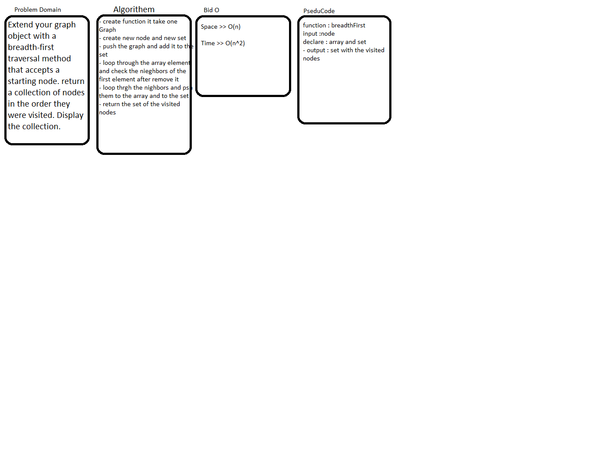

# Data Structure Graph

## Challenge

Extend your graph object with a breadth-first traversal method that accepts a starting node. return a collection of nodes in the order they were visited. Display the collection.

## Approach & Efficiency

## BigO

breadthFirst(startNode) >> O(n^2)

