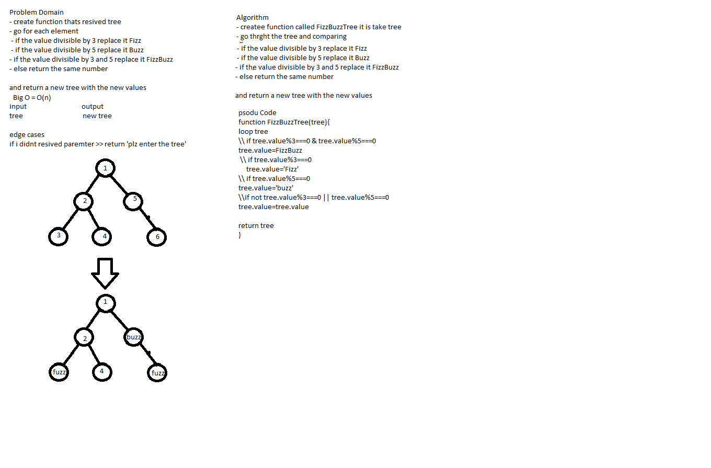

# Data Structure Tree 

## Challenge

the challenge is to impalement function called fizzBuzz it take a tree and
 - if the value for the node divided by 3 replaced `Fuzz` 
 - if the value for the node divided by 5 replaced `Buzz` 
 - if the value for the node divided by 5 and 4  replaced `FuzzBuzz`
 - if the value for the node not divided by 5 or 3 keep the number

## Approach & Efficiency

## Big O
O(n)

