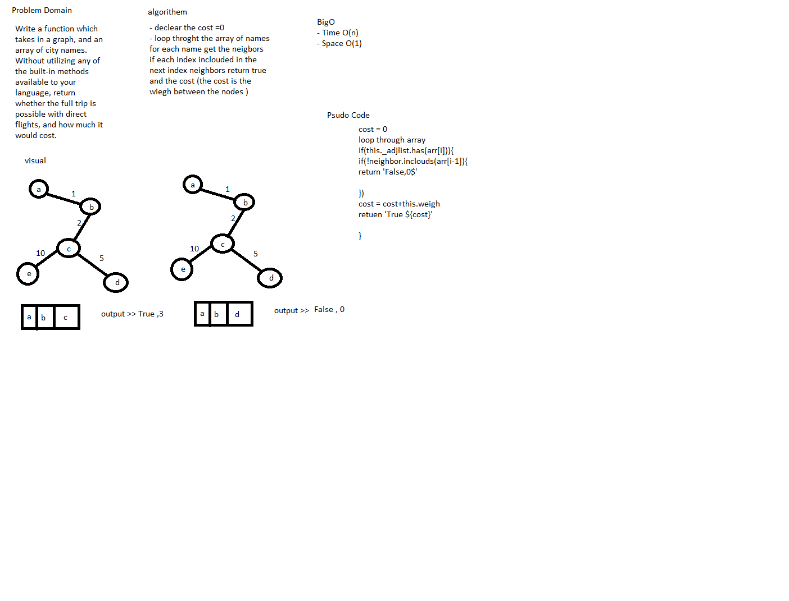

# getEdge

Implement a getEdge on a graph.

## Challenge

Write a function which takes in a graph, and an array of city names. Without utilizing any of the built-in methods available to your language, return whether the full trip is possible with direct flights, and how much it would cost.

## Approach & Efficiency

- Time Complexity: O(n)
- space O(1)

## Solution

