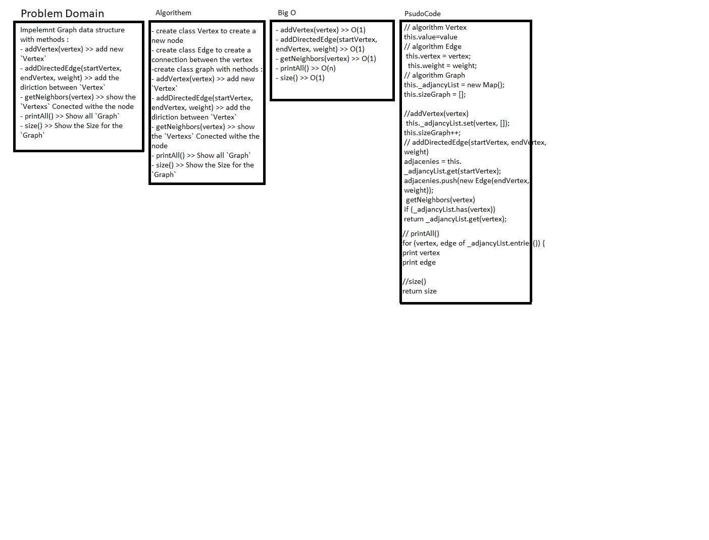

# Data Structure Graph

## Challenge

the challenge is to impalement `Graph` Data Structure

- addVertex(vertex) >> add new `Vertex`
- addDirectedEdge(startVertex, endVertex, weight) >> add the diriction between `Vertex`
- getNeighbors(vertex) >> show the `Vertexs` Conected withe the node
- printAll() >> Show all `Graph`
- size() >> Show the Size for the `Graph`

## Approach & Efficiency

## Big

- addVertex(vertex) >> O(1)
- addDirectedEdge(startVertex, endVertex, weight) >> O(1)
- getNeighbors(vertex) >> O(1)
- printAll() >> O(n)
- size() >> O(1)

