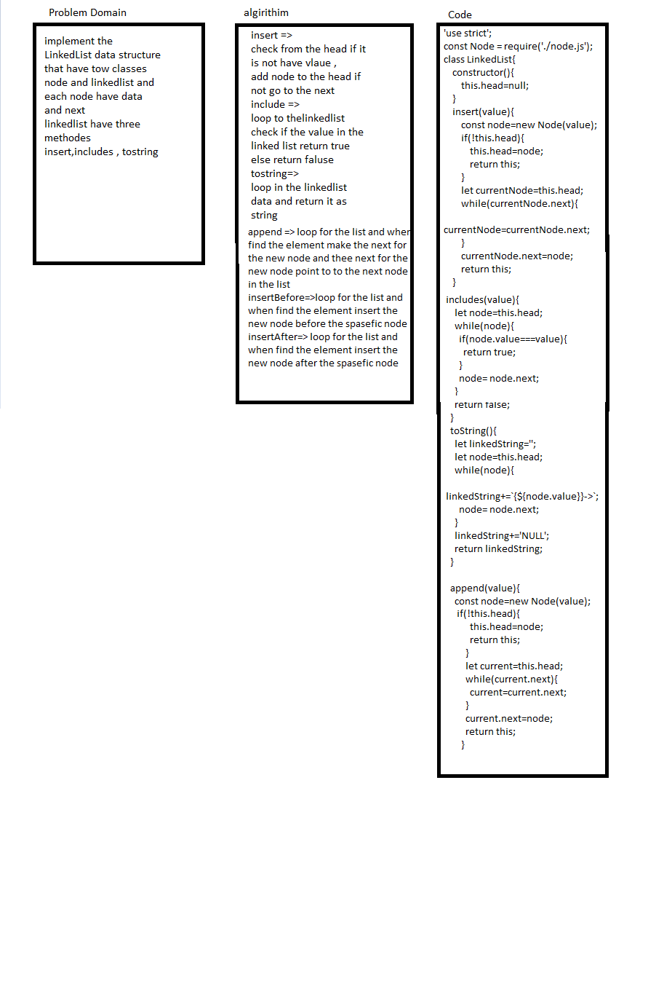

# InsertShift an Array

loops (for,while)

## Challenge
the challenge is to make linked list data structures have 3 mthod 
1. insert -> to add the node to the data
2. includes -> to search on some value and return boolean
3. toString -> to show all the data as a chain in string type end with null
4. append-> insert in the last of linked list
5. insertBefore -> insert before spacefic element 
6. insertAfter -> insert after spacefic element 
7. kthFromEnd -> Return the node’s value

## Approach & Efficiency

i used loops because i need to loop across all the elements to change the array
Big O = n

