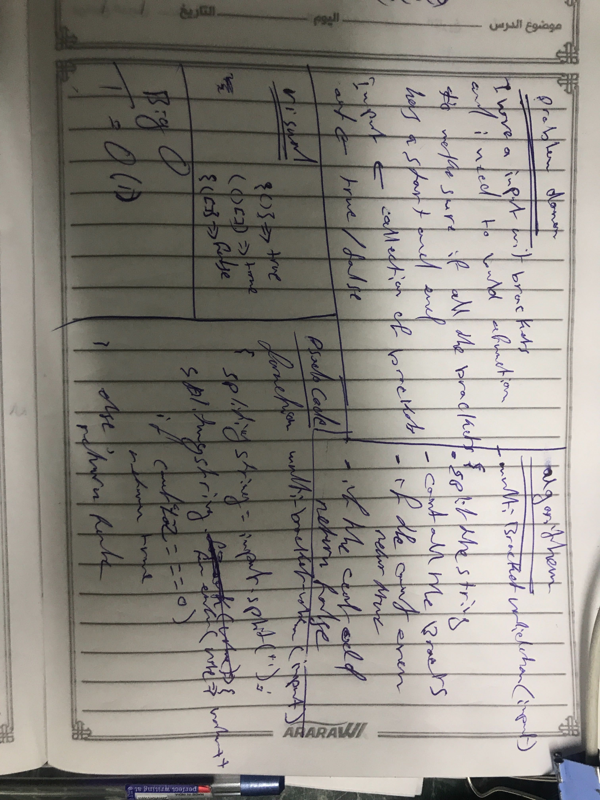

# Data Structure multiBracketValidation

# Challenge Summary
the challenge is to make sure if the string starting and ending the bracket ot not 
## Challenge Description
<!-- Description of the challenge -->

## Approach & Efficiency
Big O = 1

## Solution

