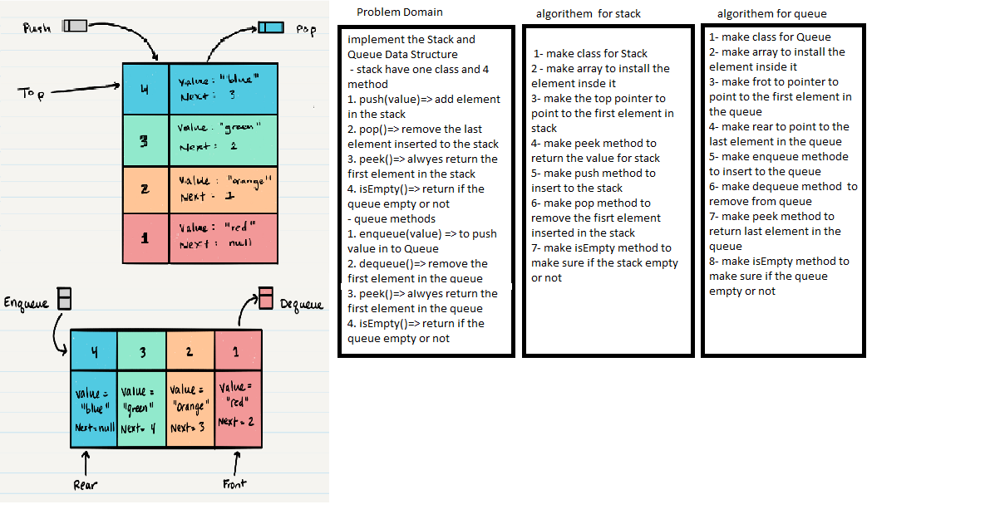

# Data Structure Stack And Queue

## Challenge

the challenge is to impelement the queue and stack 

## Queue Methodes : 
1. enqueue(value) => to push value in to Queue
2. dequeue()=> remove the first element in the queue
3. peek()=> alwyes return the first element in the queue
4. isEmpty()=> return if the queue empty or not 

## Stack Methods :
1. push(value)=> add element in the stack
2. pop()=> remove the last element inserted to the stack
3. peek()=> alwyes return the first element in the stack
4. isEmpty()=> return if the queue empty or not 

## Approach & Efficiency

Big O = 1

