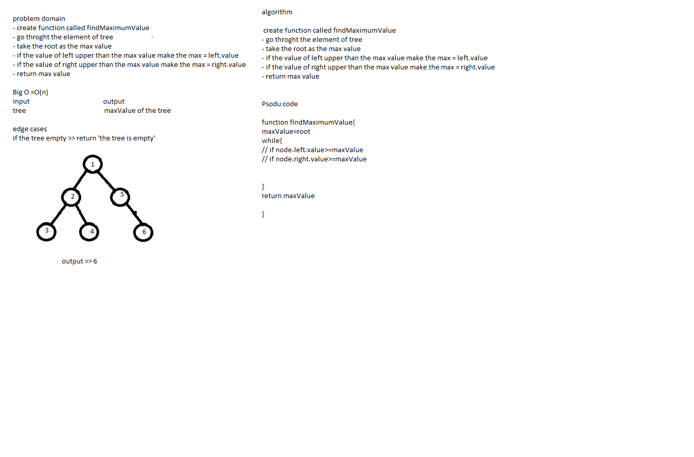

# Data Structure Tree 

## Challenge

the challenge is to impalement the tree

## Tree Method's : 

1. preOrder() >> return the order for the tree (root>> left >> right)
2. inOrder() >> return the order for the tree (left>> root >> right)
3. postOrder() >> return the order for the tree (left>> right >> root)
4. add >> to add node in the BTS
5. contain >> to make sure if the value in the tree or not 
6. breadthFirst >>  return the order for the tree (root>> left >> right)
7. findMaximumValue >> return the maximum value on the tree

## Approach & Efficiency

## Big O
preOrder >> O(n)
inOrder >> O(n)
postOrder >> O(n)
add >> O(log(n/2))
contain >> O(log(n/2))
breadthFirst >> o(n)
findMaximumValue>>o(n)

